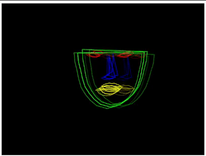

# shattered-visage

    프로젝트 진행 단계

### **Step 1: Face 인식**

### **라이브러리 사용**:

- **ml5.js**: 머신러닝 기능을 쉽게 사용할 수 있도록 돕는 JavaScript 라이브러리입니다.
- **FaceAPI**: TensorFlow.js 기반의 얼굴 감지 라이브러리로, 얼굴의 랜드마크를 감지합니다.

### **주요 기능**:

1. **얼굴 감지**:
   - 얼굴의 위치와 랜드마크(눈, 코, 입, 얼굴 윤곽)를 실시간으로 감지합니다.
2. **비디오 입력**:
   - 웹캠 비디오 스트림을 입력받아 얼굴 분석을 수행합니다.

### **진행한 작업**:

- **얼굴 감지 구현**:
  - `initializeFaceAPI`와 `detectFaces`를 통해 얼굴을 감지하는 기능을 구현했습니다.
  - 얼굴 윤곽, 눈, 코, 입의 위치를 배열로 저장하여 사용할 수 있게 했습니다.
- **비디오 입력 설정**:

  - `initializeVideo()`를 통해 웹캠의 비디오를 캔버스에 출력하면서 실시간으로 분석하는 환경을 구축했습니다.

  

---

### **Step 2: 추상 (Abstract)**

### **목표**:

- 얼굴 감지 결과를 활용하여 **추상적이고 예술적인 표현**을 시각화하는 단계입니다.

### **진행한 작업**:

1. **부유하는 물 형상 생성**:
   - 얼굴의 윤곽을 기반으로 캔버스 중앙에 하나의 **유기적인 물체**를 생성했습니다.
   - Perlin Noise를 활용해 물체의 경계를 자연스럽게 요동치게 하고 부드러운 곡선을 만들었습니다.
   - 물체는 부드럽게 상하좌우로 움직이며, 실시간으로 얼굴의 크기에 맞게 반지름이 조절됩니다.
2. **색상 변화 적용**:
   - 얼굴 랜드마크(눈, 코, 입)의 **움직임 변화를 감지**하여 색상이 실시간으로 변하도록 구현했습니다.
   - **움직임 크기**에 따라 색상이 동적으로 변경되며, `lerpColor()`를 사용해 부드러운 색상 전환을 구현했습니다.
3. **랜드마크 변화 감지**:
   - 현재 프레임의 랜드마크 좌표와 이전 프레임의 좌표를 비교해 **움직임의 크기**를 계산했습니다.
   - 이를 바탕으로 움직임이 클수록 색상이 강렬해지고, 움직임이 작을수록 부드러운 색으로 표현됩니다.

### **주요 특징**:

- **실시간 반응형 물체**:
  - 얼굴 움직임에 따라 물체가 동적으로 변화하고 부드럽게 움직입니다.
- **유기적인 경계**:
  - 물체 경계는 Perlin Noise를 기반으로 흔들리며 액체처럼 표현됩니다.
- **색상 변화**:

  - 눈, 코, 입 등 얼굴 요소의 움직임 변화에 따라 색상이 실시간으로 바뀝니다.

  

---

### **Step 3: 구체화 (Materialization)**
